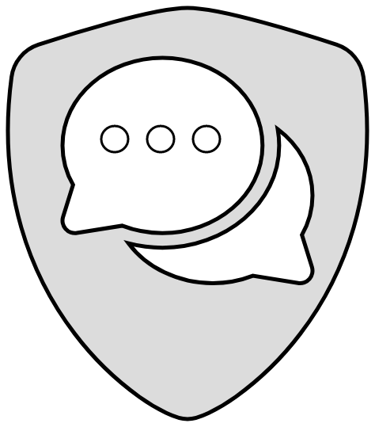

  <h1 align="center">Safetalk chat</h1>
  
  
<b>Talk with confidentiality</b>
 

  
  

   

  
  
  
  
  
  
  

   

  
  
  

   

  
  
  
  
  

   

  
  
  
  

> Status: :heavy_check_mark: done, although accepting new features and ideas

### Sections 

:small_blue_diamond: [About the project](#project-description)

:small_blue_diamond: [Features](#features)

:small_blue_diamond: [Link to running the app](#running-app)

:small_blue_diamond: [Requirements](#requirements)

:small_blue_diamond: [How to run on my local machine?](#run-local-machine)

:small_blue_diamond: [How to run the tests?](#run-tests)

<h2 id="project-description">📄 About the project</h2>

  This project was designed to provide a way to talk with confidentiality, after quitting the room all the messages are lost forever.

<h2 id="features">🚀 Features</h2>

:heavy_check_mark: Send text messages  

:heavy_check_mark: Send pictures, videos and files 

:heavy_check_mark: Record and send audios

:heavy_check_mark: Show users in the room

:heavy_check_mark: Awesome animations to make the things more fluid

:heavy_check_mark: Secure rooms with short uuid

:heavy_check_mark: Fully responsive for most kind of devices

:heavy_check_mark: send files with Drag n' drop

:heavy_check_mark: Beautiful dark design with a little touch of purple shades

<h2 id="running-app">💻 Link to the running app </h2>

...

<h2 id="requirements"> ⚙️ requirements</h2>

:warning: All you need is the [Docker](https://www.docker.com/) installed with [wsl2](https://docs.microsoft.com/pt-br/windows/wsl/install) or in any [linux distro](https://ubuntu.com/download).

<h2 id="run-local-machine">👨‍💻 How to run on my local machine?</h2>

**1° step**: clone the repository
> git clone https://github.com/YagoBiermann/safetalk-chat.git

**2° step**: you must fill the environment variables in order to make the app works fine. You can find these files in the following paths:
> `server/src/main/config/.dev.env.example`
> `docker/.docker.dev.env.example`

first of all, you've to create a <a href="https://docs.aws.amazon.com/AmazonS3/latest/userguide/create-bucket-overview.html">bucket in AWS S3</a> and setup a <a href="https://docs.aws.amazon.com/AmazonCloudFront/latest/DeveloperGuide/Introduction.html">cloudfront domain</a> in order to be able to make signed urls;
After that, put your private key used to generate the signed url in the following folder:
> `server/src/infrastructure/aws/private_aws_key.pem`

doing so, the app will be ready to work with the aws s3 bucket.

**3° step**: Just remove the **example** from env files, so it will looks like this: `.dev.env`

**4° step**: fill the env files with your own credentials

**5° step**: initiate the containers with the following command
*note: replace the command below with your own credentials*
> `cd deploy && sudo ./deploy.sh --user YOUR_DB_USERNAME --password YOUR_DB_PASSWORD --authenticationDatabase admin --development`

**6° step**: follow [this guide](./server/src/infrastructure/database/config/note.md)

**7° step**: you're done! any doubt or issue on following these steps, please, don't hesitate to contact me!

<h2 id="design-choices"> 💡 About some design choices </h2>

  The backend of this app was designed with concepts of <b> <a href="https://www.freecodecamp.org/news/a-quick-introduction-to-clean-architecture-990c014448d2">clean architecture</a></b>, <b><a href="https://martinfowler.com/bliki/DomainDrivenDesign.html">domain driven design</a></b> and <b><a href="https://12factor.net">the twelve-factor</a></b> in mind.

  This app implements some design patterns like: The <b><a href="https://refactoring.guru/design-patterns/factory-method">Factory </a></b> pattern to create the services of each layer; The <b><a href="https://refactoring.guru/design-patterns/observer">Observer</a></b> pattern to send <b><a href="https://docs.microsoft.com/dotnet/architecture/microservices/microservice-ddd-cqrs-patterns/domain-events-design-implementation">domain events</a></b>; The <b><a href="https://refactoring.guru/design-patterns/strategy">strategy</a></b> pattern to use interchangeable validations within the application services.

  Last but not least, naturally the app fits with the <b><a href="https://www.bmc.com/blogs/solid-design-principles">SOLID</a></b> principles. For example, the dependency inversion principle is applied in the domain layer where the services of infrastructure layer implements the repositories interfaces from the domain layer, that way the domain doesn't know about other modules and other modules depends on the domain, thus making the domain independent, isolated and the source of truth.

  Feel free to use this app to complement your studies about these concepts. <a href="">Here you can find the UML docs about the structure of this app.</a>

## 🚀 Features demonstration

 1. creating room and sending a message 

 

https://user-images.githubusercontent.com/55931376/172254590-6b8ab174-f446-4018-845d-9f48c246f89f.mp4

 2. sending a picture 

  

https://user-images.githubusercontent.com/55931376/172256877-31f75410-4e6d-4fc6-99d1-da7c590f4fac.mp4

  

 3. sending a file 

  
  

https://user-images.githubusercontent.com/55931376/172259009-c3559d72-5ead-4c9b-b16f-d23b57331f09.mp4

 4. sending an audio 

  
  

https://user-images.githubusercontent.com/55931376/172259051-5bda929e-b252-4993-b25f-c1f8273f4cdb.mp4

 5. showing users 

  

https://user-images.githubusercontent.com/55931376/172259441-ff0a4a23-bb33-41e8-bc75-ae1efe123541.mp4

 6. mobile version 

  
  

https://user-images.githubusercontent.com/55931376/172259946-40aa7d2b-8bcd-41c1-9921-4c4c4753d2c9.mp4

  

 7. showing friendly errors 

  
  

https://user-images.githubusercontent.com/55931376/172260353-9c659543-8689-488a-a0ee-d34a6620ca7a.mp4

  

 8. drag n' drop 

  
https://user-images.githubusercontent.com/55931376/172270948-744fb872-96a1-4dc6-b8f1-27c0e22d8a90.mp4

## :books: Languages, tools, and libs

| Frontend | Backend | Infrastructure |
| -- | -- | -- | 
| [NextJs](https://nextjs.org/)|  [NodeJs](https://nodejs.org/en/) | [MongoDb](https://www.mongodb.com/)
| [Framer Motion](https://www.framer.com/motion) | [Express](https://expressjs.com/) | [Nginx](https://www.nginx.com/)
| [Redux Toolkit](https://redux-toolkit.js.org/) | [JWT](https://jwt.io/) | [Docker](https://www.docker.com/)
| [Material UI](https://mui.com/) | [Socket Io](https://socket.io/) | [AWS services](https://aws.amazon.com/)
|[Socket Io](https://socket.io/) | ... | ... |
| [Styled components](https://styled-components.com/) | ... | ... |
| [Emoji mart](https://github.com/missive/emoji-mart) | ... | ... |
| [Axios](https://axios-http.com/) | ... | ... |

## ❗ Contributions 

🪲 If you've found any bug or problem with this project, please open an issue describing what happened.

💡 Ideas for new features are always welcome, as long as it doesn't get stray from the main idea of the app.

## :coffee: Developers/contributors

  <table>
    <tr>
      <td>
        <a href="https://github.com/YagoBiermann">
          
           
          Yago Biermann T.
        </a>
      </td>
    </tr>
  </table>

## :bookmark_tabs: License 

This app is under the [GNU General Public License]() (GPLv3).

Copyleft 2022 - Safetalk Chat
